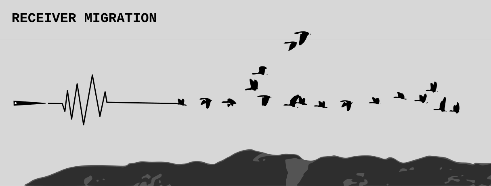

This project is dedicated to provide a Python framework for receiver functions migration, 
based on [ObsPy](https://github.com/obspy/obspy/wiki).

Requirements
------------
The code is developped on Ubuntu with Python Python 3.6.

In addition to [Python 3.6](https://www.python.org/downloads/release/python-365/), you need
to use (sometimes install) the following packages:

- [numpy](http://www.numpy.org/)
- [matplotlib](http://matplotlib.org/)
- [ObsPy](https://github.com/obspy/obspy/wiki)
- [json](https://docs.python.org/3/library/json.html)
- [os](https://docs.python.org/3/library/os.html)

How to update
-------------
The code is still experimental so you should regularly check for (and pull) 
updates.

ToDo list
-------------
- Create code about depth estimation --> bootstrap code
- Create another type of stacking --> phase-weight
- Improve plots parameters

References
----------

- S.S. Gao, K.H. Liu (2014). Imaging mantle discontinuities using multiply-reflected 
P-to-S conversions. *Earth and Planetary Science Letters*, **402**, p. 99-106.
\[[doi](https://doi.org/10.1016/j.epsl.2013.08.025)\]

- H. Gurrola, J. B. Minster, T. Owens (1994). The use of velocity spectrum for stacking receiver 
functions and imaging upper mantle discontinuities. *Geophys. J. Int.*, **117**(2), p. 427–440.
\[[doi](https://doi.org/10.1111/j.1365-246X.1994.tb03942.x)\]

- Dueker, K.G., Sheehan, A.F., (1997). Mantle discontinuity structure from midpoint stacks 
of converted P to S waves across the Yellowstone hotspot track. *J. of Geophys. Res.*, **102**(B4), p. 8313-8327.
\[[doi](https://doi.org/10.1029/96JB03857)\]
