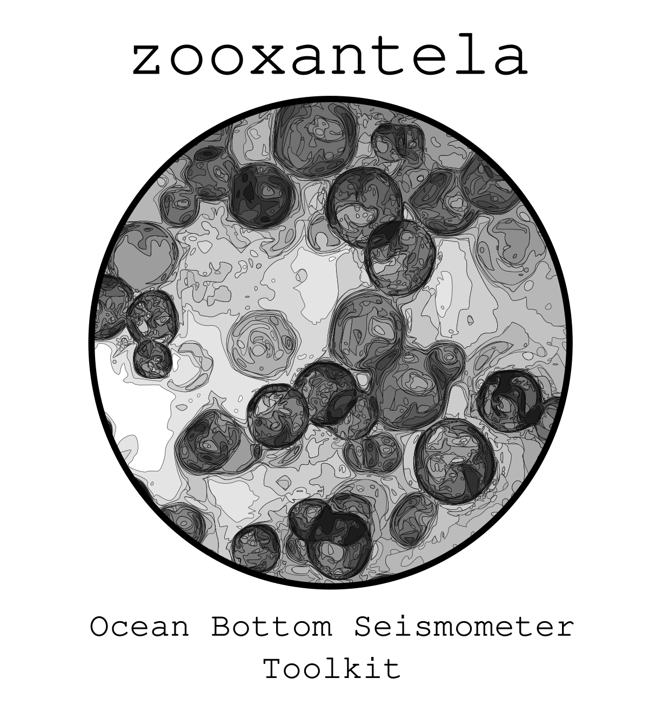

  

This project is dedicated to provide a Python framework for analysing seismological data from ocean-bottom seismometer (OBS) based on [ObsPy](https://github.com/obspy/obspy/wiki).

Version
---------
v0.1

Requirements
------------
The code is developped on Ubuntu with Python Python 3.7.

In addition to [Python 3.7](https://www.python.org/downloads/release/python-370/), you need
to install the following packages: 

- [numpy](http://www.numpy.org/)
- [matplotlib](http://matplotlib.org/)
- [ObsPy](https://github.com/obspy/obspy/wiki)
- [json](https://docs.python.org/3/library/json.html)
- [os](https://docs.python.org/3/library/os.html)
- [multiprocessing](https://docs.python.org/3/library/multiprocessing.html)

*I suggest to use the [Anaconda Cloud](https://anaconda.org/) to install your packages.

Brief explanation about the main code:
---------------------------------------

**First of all, you must to get information of your the stations:**

1) *python get_STATION_EVENT_INFORMATION.py*

**To check your dataset:**

You can plot events data to compare the data of your stations:**

2) *python cut_plot_EVENT_DATA.py*

How to update
-------------
The code is still experimental so you should regularly check for (and pull) updates.

ToDo list
-------------
- Create the main code.

References
----------

- M. Beyreuther, R. Barsch, L. Krischer, T. Megies, Y. Behr and J. Wassermann (2010).
ObsPy: A Python Toolbox for Seismology.
*SRL*, **81(3)**, 530-533. DOI: 10.1785/gssrl.81.3.530

- L. Krischer, T. Megies, R. Barsch, M. Beyreuther, T. Lecocq, C. Caudron, J. Wassermann (2015).
ObsPy: a bridge for seismology into the scientific Python ecosystem.
*Computational Science & Discovery*, **8(1)**, 014003. DOI: 10.1088/1749-4699/8/1/014003

Inspiration
----------
The code logo is based in [Zooxanthellae](https://en.wikipedia.org/wiki/Zooxanthellae), dinoflagellates that are able to live in symbiosis with diverse marine invertebrates including demosponges, corals, jellyfish, and nudibranchs. 
